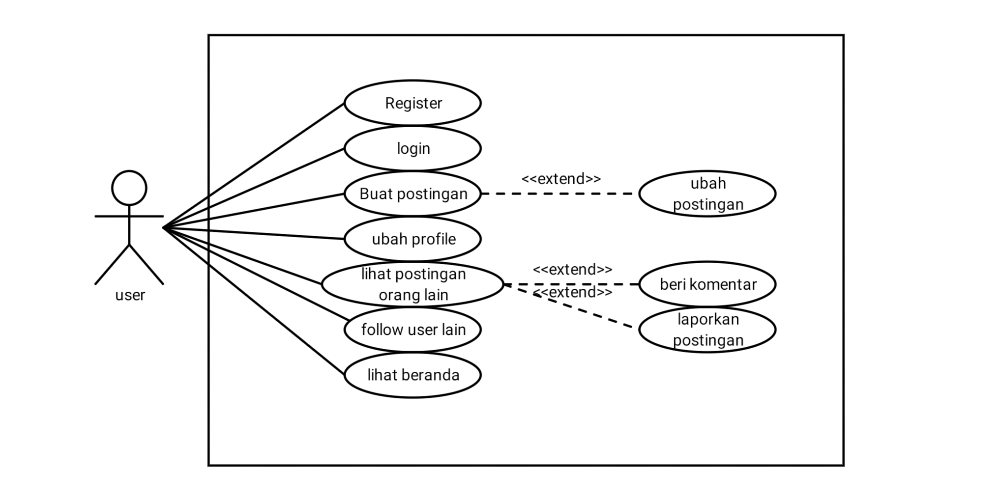
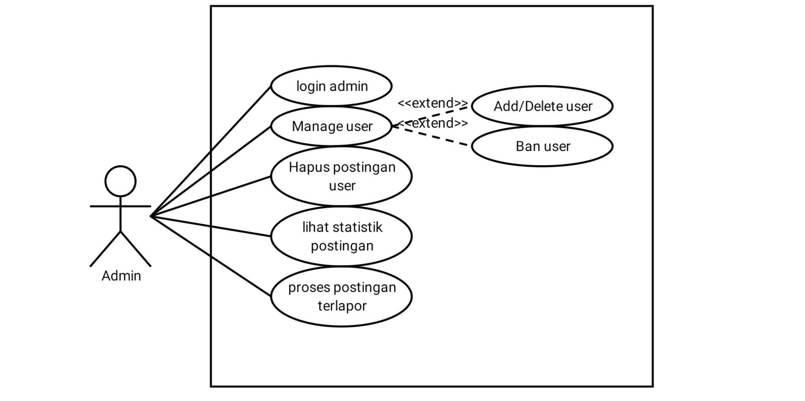

# Team J Assingment 3 Interaksi Manusia Komputer

- Ahmad Al Jufri (1313618019)
- Fernando (1313618020)
- Dhimas Amri Pratama (1313618018)

# Aplikasi My Legends / sosial media untuk pemain Mobile Legends

My Legends adalah web sosial media yang ditujukan untuk para pemain Mobile Legends. Website ini dikembangkan dengan maksud untuk mempermudah pemail Mobile Legends dalam berinteraksi dengan pemain lainnya. Pemain dapat membagikan pengalaman bermain, tips and trick, pamer rating, dan sebagainya.

## Tujuan

Tujuan dibuatnya My Legends adalah untuk mempermudah pemain Mobile Legends dalam berinteraksi dan saling membagi informasi yang mereka punya sehingga pemain dapat meningkatkan skill bermain mereka.

## Fitur

Fitur dalam mobile legends akan kami jabarkan sebagai berikut:

### Akun

- Pemain akan memiliki akun mereka masing-masing. 
- Pemain dapat mendaftar untuk mendapatkan akunnya sendiri. 
- Pemain dapat menginput sendiri data diri asli dan data karakter serta rating dalam game.

### Status / Postingan

- Status disini adalah status seperti pada facebook yang bisa muncul di beranda orang lain.
- Fitur like dan komen pada status orang lain
- Fitur posting foto / video

## Desain kontrol

  

## Usecase

  
  &nbsp &nbsp
  

## Data-data

1. Data responden kuisioner 1 (50 orang) : https://github.com/dhimasamri/My-Legends/blob/main/Phase-1/KUISIONER%20WEBSITE%20MOBILE%20LEGENDS%20(Responses).xlsx
2. Video self explaining mockup design : 
3. Data responden kuisioner 2 (kuisioner phase 2) :
4. Video presentasi UI dengan responden (Phase 2 Player mobile legend) : https://github.com/dhimasamri/My-Legends/blob/main/Phase-1/KUISIONER%20WEBSITE%20MOBILE%20LEGENDS%20(Responses).xlsx
